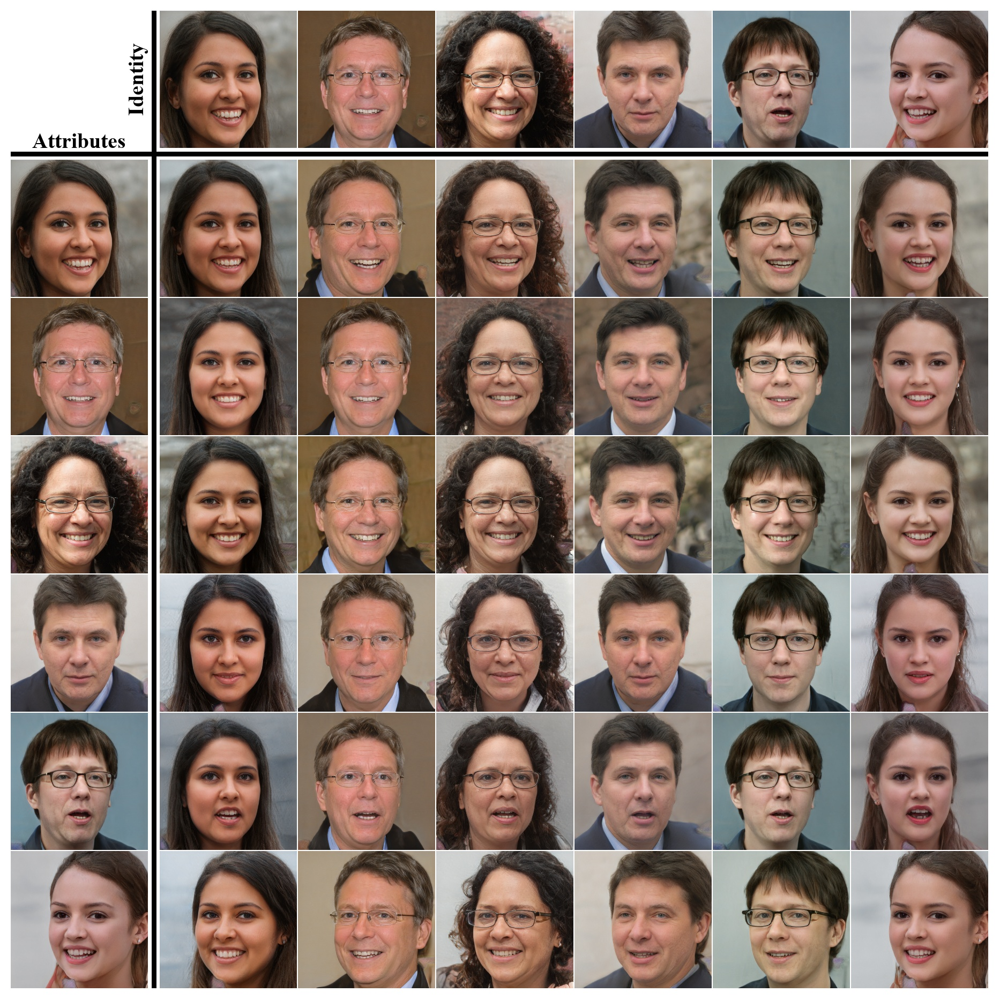
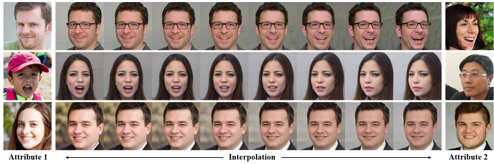

# Face Identity Disentanglement via Latent Space Mapping

<p align="center">

</p>


## Description   
Official Implementation of the paper *Face Identity Disentanglement via Latent Space Mapping*
for both training and evaluation.

> **Face Identity Disentanglement via Latent Space Mapping**<br>
> Yotam Nitzan<sup>1</sup>, Amit Bermano<sup>1</sup>, Yangyan Li<sup>2</sup>, Daniel Cohen-Or<sup>1</sup><br>
> <sup>1</sup>Tel-Aviv University, <sup>2</sup>Alibaba <br>
> https://arxiv.org/abs/2005.07728
>
> <p align="justify"><b>Abstract:</b> <i>Learning disentangled representations of data is a fundamental problem in artificial intelligence. Specifically, disentangled latent representations allow generative models to control and compose the disentangled factors in the synthesis process. Current methods, however, require extensive supervision and training, or instead, noticeably compromise quality. In this paper, we present a method that learns how to represent data in a disentangled way, with minimal supervision, manifested solely using available pre-trained networks. Our key insight is to decouple the processes of disentanglement and synthesis, by employing a leading pre-trained unconditional image generator, such as StyleGAN. By learning to map into its latent space, we leverage both its state-of-the-art quality, and its rich and expressive latent space, without the burden of training it. We demonstrate our approach on the complex and high dimensional domain of human heads. We evaluate our method qualitatively and quantitatively, and exhibit its success with de-identification operations and with temporal identity coherency in image sequences. Through extensive experimentation, we show that our method successfully disentangles identity from other facial attributes, surpassing existing methods, even though they require more training and supervision.</i></p>

## Setup

To setup everything you need check out the [setup instructions](docs/setup.md).

## Training

### Preparing the Dataset

The dataset is comprised of StyleGAN-generated images and W latent codes, both are generated from a single
StyleGAN model.

We also use real images from FFHQ to evaluate quality at test time.

The dataset is assumed to be in the following structure:

| Path | Description
| :--- | :---
| base directory | Directory for all datasets
| &boxvr;&nbsp; real | FFHQ image dataset
| &boxvr;&nbsp; dataset_N | dataset for resolution NxN
| &boxv;&nbsp; &boxvr;&nbsp; images | images generated by StyleGAN
| &boxv;&nbsp; &boxur;&nbsp; ws | W latent codes generated by StyleGAN

To generate the `dataset_N` directory, run:

```
cd utils\
python generate_fake_data.py \ 
    --resolution N \
    --batch_size BATCH_SIZE \
    --output_path OUTPUT_PATH \
    --pretrained_models_path PRETRAINED_MODELS_PATH \
    --num_images NUM_IMAGES \
    --gpu GPU
```

It will generate an image dataset in similar format to FFHQ.

### Start training

To train the model as done in the paper

```
python main.py
    NAME
    --resolution N
    --pretrained_models_path PRETRAINED_MODELS_PATH
    --dataset BASE_DATASET_DIR
    --batch_size BATCH_SIZE
    --cross_frequency 3
    --train_data_size 70000
    --results_dir RESULTS_DIR        
```

Please run `python main.py -h` for more details.

## Inference

For convenience, there are a few inference functions - each serving a different use case.
The functions are resolved using the name of the function.

### All possible combinations in dirs

<p align="center">

</p>

**Input data: Two directories, one identity inputs and another for attribute inputs.** <br>
Runs over all N*M combinations in two directories.

```
python test.py 
    Name
    --pretrained_models_path PRETRAINED_MODELS_PATH \
    --load_checkpoint PATH_TO_WEIGHTS \
    --id_dir DIR_OF_IMAGES_FOR_ID \
    --attr_dir DIR_OF_IMAGES_FOR_ATTR \
    --output_dir DIR_FOR_OUTPUTS \
    --test_func infer_on_dirs
```


### Paired data

**Input data: Two directories, one identity inputs and another for attribute inputs**. <br>
The two directories are assumed to be paired. Inference runs on images with the same names.

```
python test.py 
    Name
    --pretrained_models_path PRETRAINED_MODELS_PATH \
    --load_checkpoint PATH_TO_WEIGHTS \
    --id_dir DIR_OF_IMAGES_FOR_ID \
    --attr_dir DIR_OF_IMAGES_FOR_ATTR \
    --output_dir DIR_FOR_OUTPUTS \
    --test_func infer_pairs
```

### Disentangled interpolation

#### Interpolating attributes

<p align="center">

</p>

#### Interpolating identity

<p align="center">

</p>

**Input data: A directory with any number of subdirectories. In each subdir, there are three images.**
All images should have exactly one of *attr* or *id* in their name.
If there are two *attr* images and one *id* image, it will interpolate attribute.
If there is one *attr* images and two *id* images, it will interpolate identity.


```
python test.py 
    Name
    --pretrained_models_path PRETRAINED_MODELS_PATH \
    --load_checkpoint PATH_TO_WEIGHTS \
    --input_dir PARENT_DIR \
    --output_dir DIR_FOR_OUTPUTS \
    --test_func interpolate
```

## Checkpoints

Our pretrained 256x256 [checkpoint](https://drive.google.com/drive/folders/1lVizq4hCq-zTf8Q3fDqqfSnV6jIYEgY_?usp=sharing) is also available.

## Citation
If you use this code for your research, please cite our paper using:

```
@article{Nitzan2020FaceID,
  title={Face identity disentanglement via latent space mapping},
  author={Yotam Nitzan and A. Bermano and Yangyan Li and D. Cohen-Or},
  journal={ACM Transactions on Graphics (TOG)},
  year={2020},
  volume={39},
  pages={1 - 14}
}
```